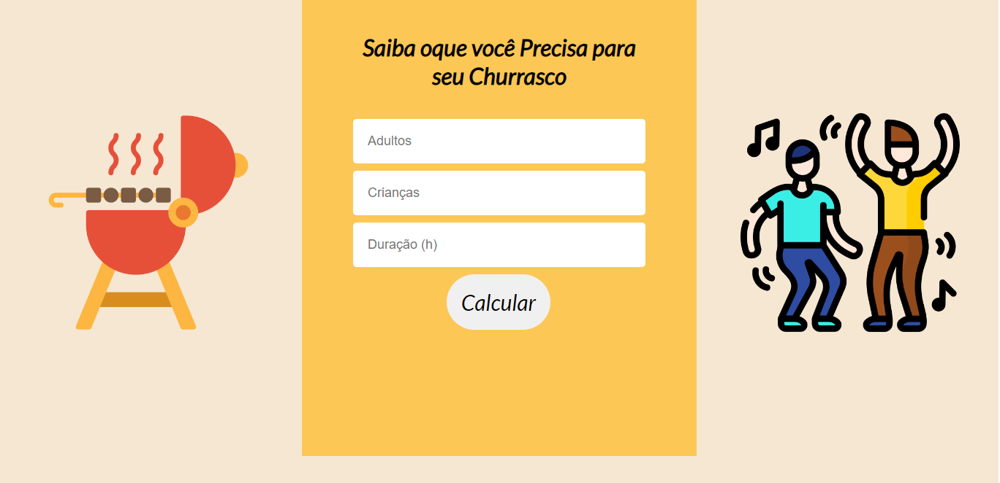

# churrascometro

	
  
  
  
  

    Projeto Desenvolvido no curso ProgBR
    

     
    

    <a href="https://jeantmc.github.io/churrascometro/"> Teste o Site
    </a>
    

     
    

    

    
    

    

    

  <a href="#clipboard-sobre-o-projeto">Sobre o Projeto</a>&nbsp;&nbsp;&nbsp;|&nbsp;&nbsp;&nbsp;
  <a href="#computer-tecnologias-utilizadas">Tecnologias</a>

## :clipboard: Sobre o Projeto

Sistema para calcular a quantidade de comida e bebida necessária para um churrasco,
 
com base nas informações seguintes:
 
Carne - 400gr por pessoa + de 6horas - 650gr
 
Cerveja - 1200ml por Pessoa + 6 horas - 2000ml
 
Refrigerante/água - 1000ml por pessoa + 6 horas 1500ml
 
Crianças valem por 0,5

## :computer: Tecnologias utilizadas

O projeto foi desenvolvido utilizando as seguintes tecnologias:

- HTML
- CSS
- JavaScript

